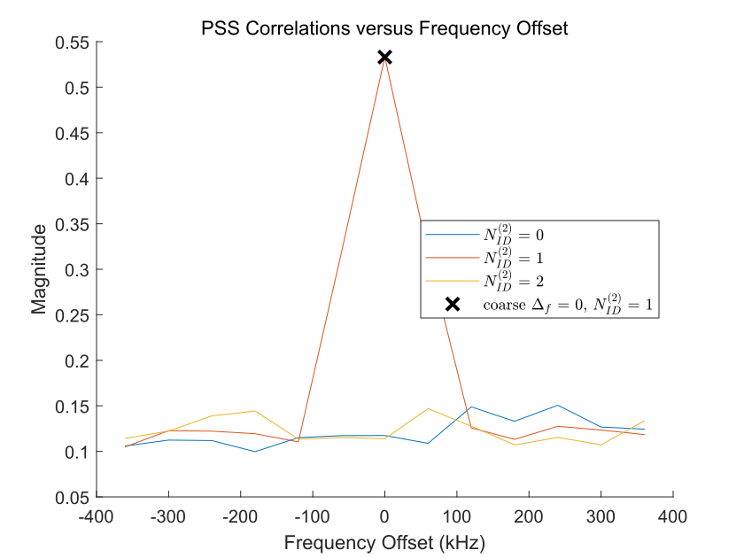
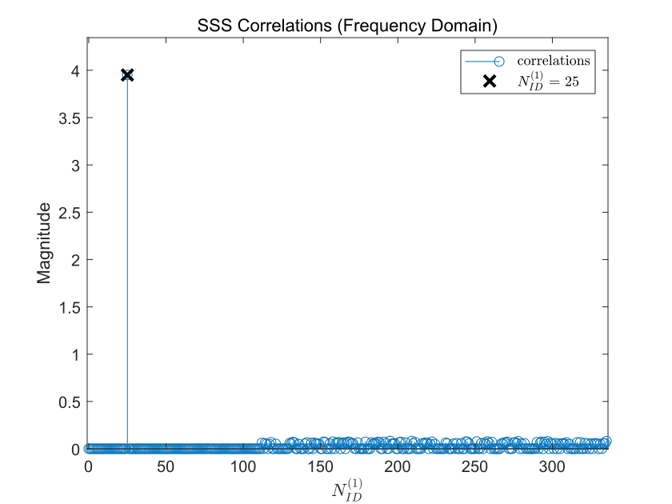
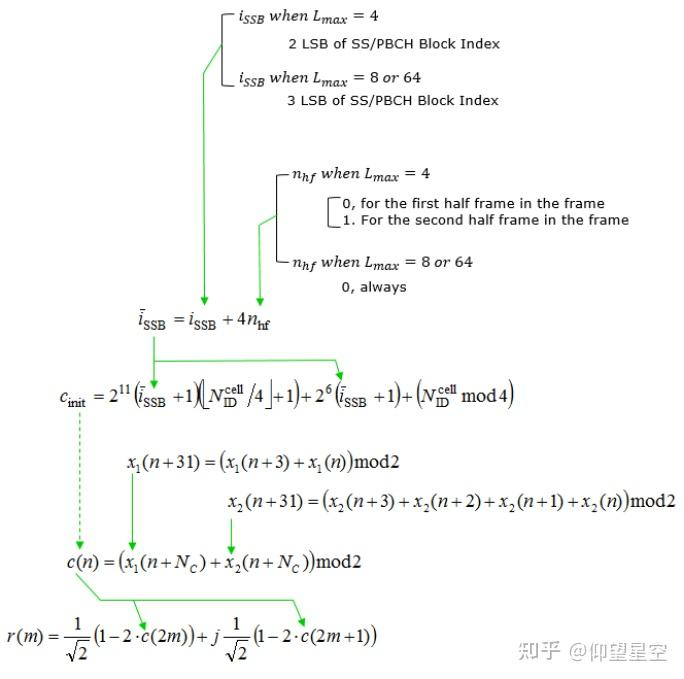
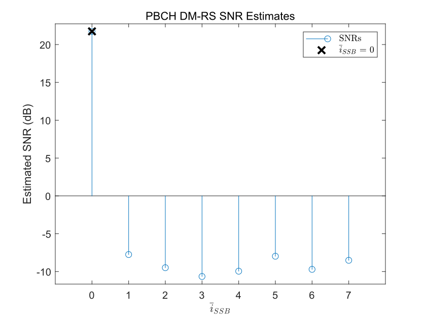
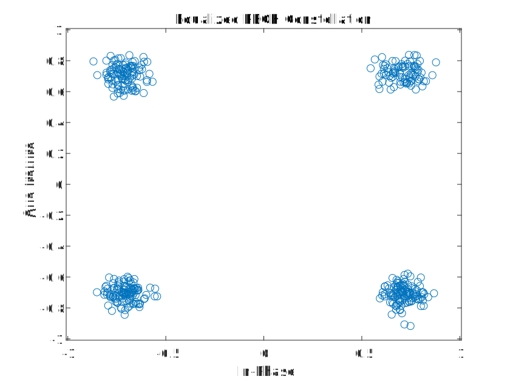
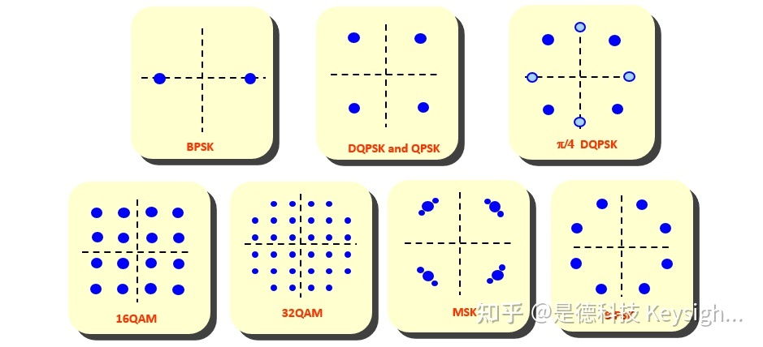

# 7.22学习笔记

注：本文中暂时没有第一部分的配置部分，但是所有实例均改变了默认参数，以丰富测试样例

参数设置如下：

```matlab
	 %配置小区ID
    config = struct();
    config.NCellID = 76;

    % 配置SS突发集
    config.BlockPattern = 'Case D';        
    config.TransmittedBlocks = ones(1,64); 
    config.SubcarrierSpacingCommon = 60;    
    config.EnableSIB1 = 0;                
```

使用Case D模式，小区ID为76，子载波间隔为60kHz，TransmittedBlocks设置为64

## 1. PSS搜索&频偏校正

```matlab
disp(' -- Frequency correction and timing estimation --')

% Specify the frequency offset search bandwidth in kHz
searchBW = 6*scsSSB;
[rxWaveform,freqOffset,NID2] = hSSBurstFrequencyCorrect(rxWaveform,refBurst.BlockPattern,sampleRate,searchBW);
disp([' 频偏: ' num2str(freqOffset,'%.0f') ' Hz'])
```

首先将搜索带宽设置为6倍的范围,然后开始搜索~

* 此处针对NID2进行搜索，NID2为小区ID对3取模，得到的只有0,1,2三个值，分别对这三个值进行PSS自相关检测，出现峰值的即为曲线所对应的NID2值即为所求的NID2值。
* **hSSBurstFrequencyCorrect**函数与**nrTimingEstimate**函数为关键函数，下面解释核心代码

```matlab
function [rxWaveform, freqOffset, NID2] = hSSBurstFrequencyCorrect(rxWaveform,ssbBlockPattern,rxSampleRate,searchBW) 
    
    %上面是不太重要的配置部分，此处省略
    fshifts = (-searchBW:scs:searchBW) * 1e3/2; 
    %此处将搜索步长设定为scs的一般，确保精度
    
    for fIdx = 1:numel(fshifts)
        for NID2 = [0 1 2]
            [~,corr] = nrTimingEstimate(rxWaveformDS,nrbSSB,scs,nSlot,refGrid(:,:,NID2+1),'SampleRate',syncSR,'Nfft',syncNfft);
            corr = sum(abs(corr),2);
            [peak_value(fIdx,NID2+1),peak_index(fIdx,NID2+1)] = max(corr);
            peak_index(fIdx,NID2+1) = peak_index(fIdx,NID2+1) + syncOfdmInfo.SymbolLengths(1);
			%peak_value是一个二维数组，索引值为频偏和NID2，代表了某频偏和NID2的情况下的最大相关系数
			%nrTimingEstimate函数用于计算指定条件下的某一频谱的自相关系数
        end
    end

    % 计算部分结束；忽视绘图部分
    
    % 决定NID2的值，通过find 语句寻找peak_value最大值出现时的NID2值；
    [fIdx,NID2] = find(peak_value==max(peak_value(:)));
    coarseFrequencyOffset = fshifts(fIdx);
    NID2 = NID2 - 1;

    % 重新生成rxWaveform
    rxWaveformFreqCorrected = rxWaveform .* exp(-1i*2*pi*coarseFrequencyOffset*t);
    rxWaveformDS = resample(rxWaveformFreqCorrected,syncSR,rxSampleRate);
    
    % 计算频偏
    offset = peak_index(fIdx,NID2+1) - 1;
       
    % 重新生成rxWaveform
    rxWaveform = rxWaveform .* exp(-1i*2*pi*freqOffset*t);
    
end
```

以上为PSS搜索函数hSSBurstFrequencyCorrect的核心代码；

而nrTimingEstimate将在下文中的时间同步部分详细解读

* **以小区ID=76，子载波间隔为60kHz，频偏为0为例**



根据计算，NID2值应为1；上图中峰值出现在了NID2=1的曲线上，峰值处对应的频偏恰为0

命令行输出：频偏: -170 Hz，为NID2=2时，曲线最大值处所对应的频偏

## 2. 时间同步与OFDM解调

* 代码部分如下：

```matlab
% 先新建一个参考网格（？Grid是这么翻译的吗），用于计算时偏（timingoffset）
refGrid = zeros([nrbSSB*12 2]);
refGrid(nrPSSIndices,2) = nrPSS(NID2); % Second OFDM symbol for correct CP length

% 计算时偏，依旧用到了这个nrTimingEstimate函数
nSlot = 0;
timingOffset = nrTimingEstimate(rxWaveform,nrbSSB,scsSSB,nSlot,refGrid,'SampleRate',sampleRate);

% Synchronization, OFDM demodulation, and extraction of strongest SS block
rxGrid = nrOFDMDemodulate(rxWaveform(1+timingOffset:end,:),nrbSSB,scsSSB,nSlot,'SampleRate',sampleRate);
rxGrid = rxGrid(:,2:5,:);

% 先计算firstSymbolLength
srRatio = sampleRate/(scsSSB*1e3*rxOfdmInfo.Nfft);
firstSymbolLength = rxOfdmInfo.SymbolLengths(1)*srRatio;

% 然后计算时偏（以一个样本间隔为单位）
str = sprintf(' 同步模块的时偏: %%.0f samples (%%.%.0ff ms) \n',floor(log10(sampleRate))-3);
fprintf(str,timingOffset+firstSymbolLength,(timingOffset+firstSymbolLength)/sampleRate*1e3);
```

**sampleRate**为采样点间隔；

**refGrid**为参考网格，第一列为0；第二列为按照一定方式生成的一个序列

srRatio貌似是一个中间量，用来计算firstSymbolLength

**firstSymbolLength**是时偏的第二部分，总时偏=计算得到的偏移量+首位时偏（大概是这个意思，翻译得可能不太精确）

**nrOFDMDemodulate**函数直接将OFDM解调，得到一个**rxGrid**

**rxGrid**会在下面用到，这里先放着

* **nrTimingEstimate**的代码如下：

```matlab
function [offset,mag] = nrTimingEstimate(varargin)
    narginchk(3,14);
    
    % Get optional inputs or inputs whose position depends upon the syntax
    [waveform,refGrid,ofdmInfo,initialNSlot,hasSampleRate] = getOptionalInputs(varargin{:});
    
    % Get the number of ports P in the reference resource grid
    P = size(refGrid,3);
    
    % Perform OFDM modulation
    overlapping = false;
    ref = nr5g.internal.OFDMModulate(refGrid,ofdmInfo,initialNSlot,overlapping,hasSampleRate);
    
    % Get the number of time samples T and receive antennas R in the 
    % waveform
    [T,R] = size(waveform);
    
    % Pad the input waveform if necessary to make it longer than the
    % correlation reference signal; this is required to normalize xcorr
    % behavior as it always pads the shorter input signal
    minlength = size(ref,1);
    if (T < minlength)
        waveformPad = [waveform; zeros([minlength-T R],'like',waveform)];
        T = minlength;
    else
        waveformPad = waveform;
    end
    
    % Create array 'mag' to store correlation magnitude for each time
    % sample, receive antenna and port
    mag = zeros([T R P],'like',waveformPad);
    
    % For each receive antenna
    for r = 1:R
        
        % For each port
        for p = 1:P
        
            % Correlate the given antenna of the received signal with the
            % given port of the reference signal
            refcorr = xcorr(waveformPad(:,r),ref(:,p));
            mag(:,r,p) = abs(refcorr(T:end));
            
        end
        
    end
    
    % Sum the magnitudes of the ports
    mag = sum(mag,3);
    
    % Find timing peak in the sum of the magnitudes of the receive antennas
    [~,peakindex] = max(sum(mag,2));
    offset = peakindex - 1;
    
end
```

这个函数除了可以用来做自PSS相关检测以外，还可以直接用来计算时偏；

* 这部分代码的运行结果：

命令行输出：同步模块的时偏: 2224 samples (0.0362 ms) 

## 3. SSS搜索

```matlab
% 从SS/PBCH块中提取接收到的SS Symbol
sssIndices = nrSSSIndices;
sssRx = nrExtractResources(sssIndices,rxGrid);

% 用for循环搜索
sssEst = zeros(1,336);
for NID1 = 0:335

    ncellid = (3*NID1) + NID2;
    sssRef = nrSSS(ncellid);
    sssEst(NID1+1) = sum(abs(mean(sssRx .* conj(sssRef),1)).^2);

end

% 绘图
figure;
stem(0:335,sssEst,'o');
title('SSS Correlations (Frequency Domain)');
xlabel('$N_{ID}^{(1)}$','Interpreter','latex');
ylabel('Magnitude');
axis([-1 336 0 max(sssEst)*1.1]);

% 用find计算NID1
NID1 = find(sssEst==max(sssEst)) - 1;

% 绘制
hold on;
plot(NID1,max(sssEst),'kx','LineWidth',2,'MarkerSize',8);
legend(["correlations" "$N_{ID}^{(1)}$ = " + num2str(NID1)],'Interpreter','latex');

% 计算小区ID
ncellid = (3*NID1) + NID2;

disp([' 小区ID: ' num2str(ncellid)])
```

这部分代码与**hSSBurstFrequencyCorrect**的内容有某些相似之处

主要任务是解出NID1，然后就能计算出小区ID

* 还是以上述例子为例，计算得到的小区ID如下：



命令行输出： 小区ID: 76，与预设值相同

*至此，所有的工作都是为了得到小区ID，工作也很清晰明白；接下来是解扰解调解码工作。*

*有以下几个困惑点：*

*① 为什么要先解PBCH DMRS，这一步得到了什么？* 

​	**- 得到了i拔SSB**

*② i拔SSB的意义是什么？*

​	**- 得到v，进行BCH解码**

*③ H是什么指标？* 

​	***-貌似需要用到IFFT的知识，容我先学习一下***

*④ 信道估计和信道均衡的目的是？*

 	- 知乎上面有讲解，信道估计的目的是算**H**；信道均衡的目的是“**接收端通过已经接收到的y，和在这之前已经通过信道估计得到的H，来补偿信道对于信号的影响，从而有助于恢复出x。**”

## 4. PBCH DM-RS搜索 && 基于PBSH DMRS与SSS的信道预测

由于这两个模块有相同的部分（也就是**nrChannelEstimate**这么个很长很长的函数），我把这两块部分结合起来整理了一下

```matlab
% 首先从小区ID中 获得这个PBCH DMRS indices【也就是PBCH DMRS所处的频域位置】
dmrsIndices = nrPBCHDMRSIndices(ncellid);

% 然后根据不同的i拔SSB计算信噪比，得到信噪比最高的i拔SSB
dmrsEst = zeros(1,8);
for ibar_SSB = 0:7

    refGrid = zeros([240 4]);
    refGrid(dmrsIndices) = nrPBCHDMRS(ncellid,ibar_SSB);
    [hest,nest] = nrChannelEstimate(rxGrid,refGrid,'AveragingWindow',[0 1]);
    dmrsEst(ibar_SSB+1) = 10*log10(mean(abs(hest(:).^2)) / nest);

end

% 绘图
figure;
stem(0:7,dmrsEst,'o');
title('PBCH DM-RS SNR Estimates');
xlabel('$\overline{i}_{SSB}$','Interpreter','latex');
xticks(0:7);
ylabel('Estimated SNR (dB)');
axis([-1 8 min(dmrsEst)-1 max(dmrsEst)+1]);

% 用find指令找到i拔SSB
ibar_SSB = find(dmrsEst==max(dmrsEst)) - 1;

% 继续绘图
hold on;
plot(ibar_SSB,max(dmrsEst),'kx','LineWidth',2,'MarkerSize',8);
legend(["SNRs" "$\overline{i}_{SSB}$ = " + num2str(ibar_SSB)],'Interpreter','latex');


%% 下面是信道估计的部分（当然也包含了噪声估计），或者说，信道预测
refGrid = zeros([nrbSSB*12 4]);
refGrid(dmrsIndices) = nrPBCHDMRS(ncellid,ibar_SSB);
refGrid(sssIndices) = nrSSS(ncellid);
[hest,nest,hestInfo] = nrChannelEstimate(rxGrid,refGrid,'AveragingWindow',[0 1]);
```

其中有一个重要的函数**nrChannelEstimate**，用于返回信道预测H以及噪声方差预测NVar

```matlab
% 这个函数太长了，这里先不分析具体过程
```

从知乎上面摘录下来：

***

### 信道估计和噪声方差的步骤如下：

（1）SSB占240个子载波，为缓解边带效应，在上边缘和下边缘各加入2个PRB，也就是24个虚拟子载波，因此总共有288个子载波。

此时资源网格维度是288*4，其实看后三列就可以，因为PBCH没有分布在第一列资源网格上；

（2）已知PBCH DM-RS的在资源网格上的时频位置和接收信号值，采用LS算法进行信道估计，再采用interpolate算法对PBCH的时频位置进行插值得到完整Hdn，维度288*4，其实看后三列就可以；

（3）对Hdn进行IFFT转化到时域h，并对h进行时域w加窗，再做fft转换到H。

***<u>【由于IFFT本人还没具体学习过，所以这两天需要先补一下IFFT的知识】</u>***

其中，**窗的类型是升余弦窗，窗的长度考虑CP长度和资源网格子载波个数（包括虚拟子载波）。**

```matlabsession
    % Create time-domain windowing function for CIR denoising
    w = raised_cosine_window(cp*2,cp);
    w = [w; zeros([K+eK-length(w) 1])];
    w = circshift(w,-cp-floor(cp/2));
```

这是ifft和fft的过程。

```text
Hk = interpolate(1,kevp,n,Hvp,krange,n,'spline',0);
                H(krange,n,r,p) = Hk(:,1);
                
                % Perform an IDFT of the channel estimate to give the CIR
                h = ifft(H(:,n,r,p));

                % Apply time domain windowing function to denoise CIR
                h = h .* w;

                % Perform a DFT of the CIR to give the denoised CFR
                H(:,n,r,p) = fft(h);
```

（4）通过Hn与H做出噪声功率nVar的估计,即var(Hn - H)*s，其中**s来自经验值**。

```matlabsession
s = determineNoiseScaling(ofdmInfo,subnR1,fdCDM,tdCDM);
        nVar = var(Hn - Hdn) * s;
```

（5）在频域和时域方向做平均，averaging and interpolation in frequency and time direction。

至此，信道估计过程结束。

***

除此之外还需要对iSSB做一些解释：
$$
\overline{i}_{SSB}
$$




***

* 这个是运行结果，i拔SSB是0



## 5. 信道均衡与PBCH解调

```matlab
% 从SS/PBCH中提取出PBCH Symbol
[pbchIndices,pbchIndicesInfo] = nrPBCHIndices(ncellid);
pbchRx = nrExtractResources(pbchIndices,rxGrid);

% Configure 'v' for PBCH scrambling according to TS 38.211 Section 7.3.3.1
% 'v' is also the 2 LSBs of the SS/PBCH block index for L_max=4, or the 3 LSBs for L_max=8 or 64.
if refBurst.L_max == 4
    v = mod(ibar_SSB,4);
else
    v = ibar_SSB;
end
ssbIndex = v;
```

首先说明一下L的含义：从上面对i拔SSB的计算式中可以看出，L取4/8/64的时候，所对应的nhf也不同，因而issb也不同；此处的v值决定了扰码序列，用于后续的解扰工作。

```matlab
% 信道均衡 + 计算CSI
pbchHest = nrExtractResources(pbchIndices,hest);
[pbchEq,csi] = nrEqualizeMMSE(pbchRx,pbchHest,nest);
Qm = pbchIndicesInfo.G / pbchIndicesInfo.Gd;
csi = repmat(csi.',Qm,1);
csi = reshape(csi,[],1);

% 绘制星座图
figure;
plot(pbchEq,'o');
xlabel('In-Phase'); ylabel('Quadrature')
title('Equalized PBCH Constellation');
m = max(abs([real(pbchEq(:)); imag(pbchEq(:))])) * 1.1;
axis([-m m -m m]);
```

信道均衡部分使用了**nrExtractResources**函数，用于从源数组中提取元素，此处提取指定索引的H数组，该索引pbchIndices由小区ID获得。

还有**nrEqualizeMMSE**函数，做MMSE信道均衡。

信道均衡的目的：接收端通过已经接收到的y，和在这之前已经通过信道估计得到的H，来补偿信道对于信号的影响，从而有助于恢复出x。

**nrEqualizeMMSE**函数的定义如下：

```matlab
function [out,csi] = nrEqualizeMMSE(rxSym,Hest,nVar)
    narginchk(3,3);

    % 先validate输入变量
    fcnName = 'nrEqualizeMMSE';
    validateattributes(rxSym,{'double','single'},{'2d'},fcnName,'RXSYM');
    validateattributes(Hest,{'double','single'},{'3d'},fcnName,'HEST');
    validateattributes(nVar,{'double','single'},{'scalar','real','nonnegative','finite'},fcnName,'NVAR');
    coder.internal.errorIf(size(rxSym,1) ~= size(Hest,1),'nr5g:nrEqualizeMMSE:UnequalNumOfREs',size(rxSym,1),size(Hest,1));
    coder.internal.errorIf(size(rxSym,2) ~= size(Hest,2),'nr5g:nrEqualizeMMSE:UnequalNumOfRxAnts',size(rxSym,2),size(Hest,2));

    % 拓展输入维度
    nRE = size(Hest,1); % Number of resource elements
    R = size(Hest,2);   % Number of receive antennas
    P = size(Hest,3);   % Number of layers

    % 基于输入维度初始化输出维度
    out = zeros(nRE,P,'like',rxSym);
    csi = zeros(nRE,P,class(rxSym));

    if (P == 1)    % For SISO or SIMO case
        csi = sum(Hest .* conj(Hest), 2) + nVar;
        G = conj(Hest)./csi;
        out = sum(G.*rxSym, 2);
    else           % For MISO or MIMO case
    
        % 然后开始用某种算法进行信道均衡
        %
        
        Hest = permute(Hest,[2 3 1]);
        if (P > R) || ~isempty(coder.target)
            Itx = eye(P);
            n0eye = nVar*Itx;
            for REIdx=1:nRE
                H = Hest(:,:,REIdx);
                temp = (H'*H + n0eye)\Itx;
                csi(REIdx,:) = 1./real(diag(temp));
                G = temp*H';
                out(REIdx,:) = G*(rxSym(REIdx,:).');
            end
        else
            [ub, sb, vb] = pagesvd(Hest,"econ","vector"); % sb in columns
            oneovers2plusn0 = 1./((nVar*ones(1,P))+pagetranspose(sb .* sb));
            csi = 1 ./ squeeze(sum(oneovers2plusn0 .* real(vb .* conj(vb)), 2)).';
            sOvers2plusn0 = pagetranspose(sb) .* oneovers2plusn0;
            % temp2= U' * rxSym where rxSym is in columns
            temp2 = pagemtimes(reshape(rxSym.', 1, R, nRE), conj(ub));
            out   = permute(pagemtimes(sOvers2plusn0.* temp2, pagetranspose(vb)), [3 2 1]);
        end
    end

end
```

* 运行过程中生成的星座图如下：



看这个[星座图](https://zhuanlan.zhihu.com/p/594337231)，像是QPSK



```matlab
% PBCH 解调
pbchBits = nrPBCHDecode(pbchEq,ncellid,v,nest);

% Calculate RMS PBCH EVM
pbchRef = nrPBCH(pbchBits<0,ncellid,v);
evm = comm.EVM;
pbchEVMrms = evm(pbchRef,pbchEq);

% Display calculated EVM
disp([' PBCH RMS EVM: ' num2str(pbchEVMrms,'%0.3f') '%']);
```

PBCH解码函数为**nrPBCHDecode**，这里暂且先不展开研究

***

### EVM是什么

**EVM**就是误差矢量模，其中包含幅度误差和相位误差，是误差矢量的RMS幅度与最大符号幅度之比，并以百分比来表示，是I/Q星座图中被检测的实际信号与理想信号间的差距。

这里直接用**evm**函数计算出了EVM

***

命令行输出：PBCH RMS EVM: 8.320%

这个EVM值大吗？还是说在理想范围内？

## 6. BCH解码

```matlab
% Apply CSI【不知道干什么用的】
pbchBits = pbchBits .* csi;

% 解码Polar码，还有CRC
[~,crcBCH,trblk,sfn4lsb,nHalfFrame,msbidxoffset] = ...
    nrBCHDecode(pbchBits,polarListLength,refBurst.L_max,ncellid);

% 显示CRC
disp([' BCH CRC: ' num2str(crcBCH)]);

% 接受有误，暂停接收！
if crcBCH
    disp(' BCH CRC is not zero.');
    return
end

% Use 'msbidxoffset' value to set bits of 'k_SSB' or 'ssbIndex', depending
% on the number of SS/PBCH blocks in the burst
if (refBurst.L_max==64)
    ssbIndex = ssbIndex + (bit2int(msbidxoffset,3) * 8);
    k_SSB = 0;
else
    k_SSB = msbidxoffset * 16;
end

% 显示SSB索引值
disp([' SSB index: ' num2str(ssbIndex)]);
```

***

### PBCH和BCH的关系

5G NR PBCH所承载的比特数共56bit，其中有24bit来自高层广播信道（BCCH-BCH），包括23bit的MIB。物理层提供PBCH中其余的32bit，其中包括24bit循环冗余校验（Cyclic Redundancy Check，CRC）比特。除SSB时间索引和CRC比特之外，同一个SSB突发集内所有SSB的PBCH内容是相同的。

首先，将来自高层的24bit BCCH-BCH信息，其中包括23bit MIB。24bit的BCCH-BCH信息与来自物理层SSB传输时间相关的信息组合，生成32bit PBCH有效载荷。其次，32bit PBCH有效载荷经历交织、第一次加扰、附加CRC等过程，产生56bit PBCH载荷，通过极化编码、速率匹配、第二次加扰、QPSK调制，生成总共有432个符号的PBCH序列。最后，432个符号的PBCH序列与144个符号的PBCH DM-RS序列一起被映射到用于传输的SSB。

上一部分的PBCH解调指的是解第二次加扰、QPSK调制、速度编码；

本部分的BCH解码指的是解第一次加扰、CRC、Polar码

***

命令行输出：

 BCH CRC: 0
 SSB index: 0

CRC为0说明没问题，SSB index是0

## 7. 获取MIB

```matlab
mib = fromBits(MIB,trblk(2:end)); % Do not parse leading bit

% Create a structure containing complete initial system information
initialSystemInfo = initSystemInfo(mib,sfn4lsb,k_SSB,refBurst.L_max);

% Display the MIB structure
disp(' BCH/MIB Content:')
disp(initialSystemInfo);

% Check if a CORESET for Type0-PDCCH common search space (CSS) is present,
% according to TS 38.213 Section 4.1
if ~isCORESET0Present(refBurst.BlockPattern,initialSystemInfo.k_SSB)
    fprintf('CORESET 0 is not present (k_SSB > k_SSB_max).\n');
    return
end
```

一个**fromBits**函数就能够获得MIB了，**trblk**则是从BCH解码中获得

最后一步比较清晰明朗，比较难理解的是4 5 6这三步，尤其是我中间提出的几个*<u>困惑点</u>*，都需要再仔细思索一下。

下一步安排： 换几个参数试验一下； 学习IFFT，理解H和NVar； ...
